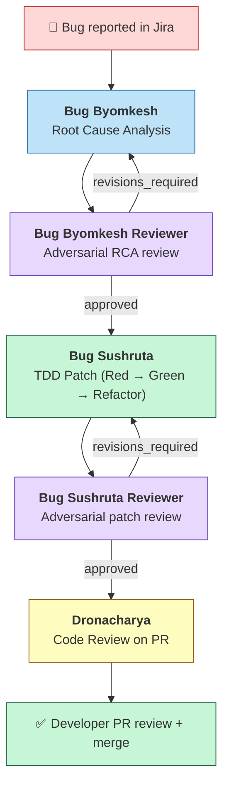
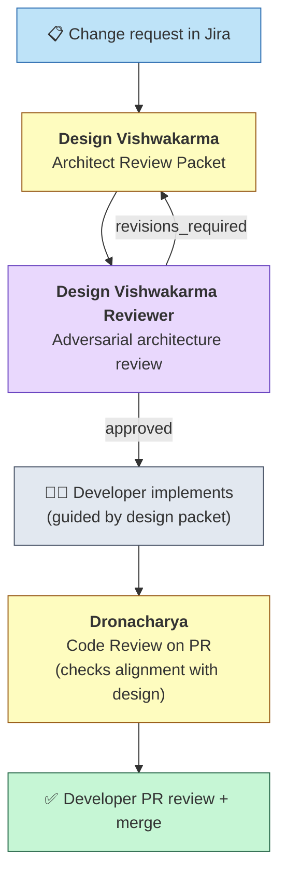
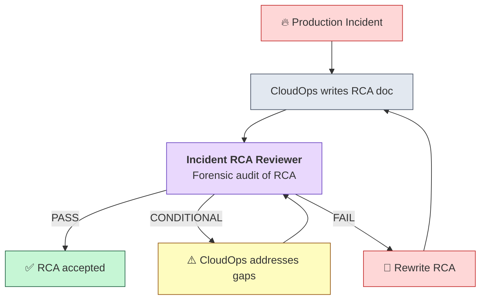
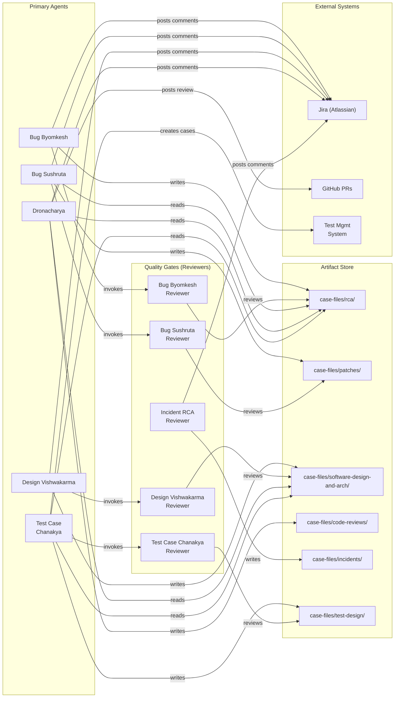

# FlowCraft Skills

> **17 skill playbooks. 13 specialized AI agents. One command to install.**

[](https://www.npmjs.com/package/@flowcraft.systems/skills)
[](LICENSE.md)

FlowCraft Skills plugs a coordinated AI engineering crew into your GitHub Copilot workspace. Each agent is a specialist — bug investigator, patch engineer, architect coach, code reviewer, test designer, customer communicator. They enforce quality gates, chain together automatically, and post structured artifacts directly to your Jira issues and GitHub PRs.

> **v2.0** · April 2026

---

## Installation

Add FlowCraft agents and skills to your repo with a single command — no global install needed:

```bash
npx @flowcraft.systems/skills install
```

This copies `.github/agents/` and `.github/skills/` into your current directory. Commit the result so your whole team benefits automatically.

### Common options

```bash
# Preview what will be installed without writing anything
npx @flowcraft.systems/skills install --dry-run

# Install into a specific project directory
npx @flowcraft.systems/skills install --dest ~/projects/my-app

# Overwrite files that already exist (re-install / upgrade)
npx @flowcraft.systems/skills install --force

# Skills only — skip agent persona files
npx @flowcraft.systems/skills install --skills-only

# Agents only — skip skill SKILL.md files
npx @flowcraft.systems/skills install --agents-only

# See what's bundled before installing
npx @flowcraft.systems/skills list
```

### Global install (optional)

```bash
npm install -g @flowcraft.systems/skills
flowcraft-skills install
```

> **Requirements:** Node.js ≥ 18

---

## What You Get

**17 skill playbooks** that encode proven engineering methodologies — load any skill directly in GitHub Copilot for instant structured guidance, or let agents compose them automatically into multi-pass workflows.

**13 specialized AI agents** covering the full software engineering lifecycle:

| Agent | What it delivers |
|-------|------------------|
| **Bug Byomkesh** | Root cause analysis — evidence-cited hypotheses, blast-radius analysis, and findings posted to Jira |
| **Bug Sushruta** | TDD patch engineer — writes failing tests first, applies minimal fix, handles feature flags |
| **Design Vishwakarma** | Architect coach — design options, ADRs, and fitness functions before a line of code is written |
| **Dronacharya** | Code review mentor — PR alignment review posted directly to GitHub + Jira, mentor tone |
| **Test Case Chanakya** | QA test designer — risk-based test suites synced to your test management system |
| **Narada** | Customer communicator — jargon-free incident briefings for non-technical stakeholders |
| **Incident RCA Reviewer** | CloudOps auditor — independent forensic review of production incident RCAs |

Every primary agent ships with a paired **Reviewer agent** that adversarially scores its output before anything is posted — quality gates built in, not bolted on.

---

## Table of Contents

- [What You Get](#what-you-get)
- [How It Works](#how-it-works)
- [Agent Ecosystem Overview](#agent-ecosystem-overview)
- [Visual Workflow Map](#visual-workflow-map)
- [Skills Catalog](#skills-catalog)
- [Agent Catalog](#agent-catalog)
  - [1. Bug Byomkesh — Root Cause Analyst](#1-bug-byomkesh--root-cause-analyst)
  - [2. Bug Byomkesh Reviewer — RCA Quality Gate](#2-bug-byomkesh-reviewer--rca-quality-gate)
  - [3. Bug Sushruta — Patch Engineer](#3-bug-sushruta--patch-engineer)
  - [4. Bug Sushruta Reviewer — Patch Quality Gate](#4-bug-sushruta-reviewer--patch-quality-gate)
  - [5. Design Vishwakarma — Architect Coach](#5-design-vishwakarma--architect-coach)
  - [6. Design Vishwakarma Reviewer — Architecture Quality Gate](#6-design-vishwakarma-reviewer--architecture-quality-gate)
  - [7. Dronacharya — Code Review Coach](#7-dronacharya--code-review-coach)
  - [8. Incident RCA Reviewer — CloudOps Auditor](#8-incident-rca-reviewer--cloudops-auditor)
  - [9. Narada — Customer Communications Specialist](#9-narada--customer-communications-specialist)
  - [10. Narada Reviewer — Briefing Quality Gate](#10-narada-reviewer--briefing-quality-gate)
  - [11. Test Case Chanakya — QA Test Designer](#11-test-case-chanakya--qa-test-designer)
  - [12. Test Case Chanakya Reviewer — Test Design Quality Gate](#12-test-case-chanakya-reviewer--test-design-quality-gate)
  - [13. Agent Test: Bug Byomkesh — Performance Evaluator](#13-agent-test-bug-byomkesh--performance-evaluator)
- [Using Skills Without Agents](#using-skills-without-agents)
- [Agent Pipelines — When to Chain Agents](#agent-pipelines--when-to-chain-agents)
- [Output Locations](#output-locations)
- [Power User Tips](#power-user-tips)
- [Troubleshooting](#troubleshooting)

---

## How It Works

FlowCraft Skills is built on a **skills-first architecture**: skills are the reusable building blocks; agents are the orchestrators that compose them.

### Skills: Independent Playbooks

A **skill** is a self-contained methodology document in `.github/skills/<name>/SKILL.md`. Each skill teaches one discipline — hypothesis-driven investigation, TDD red-green-refactor, blast-radius analysis, etc. — and can be used in three ways:

1. **By agents** — Agents load skills at specific passes to follow their methodology. Bug Byomkesh loads `hypothesis-driven-investigation` at PASS 1, `git-forensics` at PASS 2, etc.
2. **By you directly** — Ask Copilot to "follow the hypothesis-driven-investigation skill" on a bug report. You get the structured methodology without running the full agent, saving premium requests when you only need part of the workflow.
3. **By other skills** — Skills reference each other. The `adversarial-review` skill defines the scoring framework used by all reviewer agents.

Skills are **versioned, testable, and portable**. When you improve a skill, every agent that loads it benefits automatically.

### Agents: Intelligent Orchestrators

An **agent** is a persona in `.github/agents/<name>.agent.md` that orchestrates a multi-pass workflow, loading the right skills at each pass, calling the right MCP tools, and producing structured artifacts. Agents add:

- **Sequencing** — Which skills to load in which order (PASS 0, PASS 1, ...)
- **Tool access** — MCP connections to Jira, GitHub, test management system, browser DevTools
- **Quality gates** — Auto-invocation of reviewer agents
- **Artifact management** — Writing to `case-files/`, posting to Jira, commenting on PRs

Think of it as: **skills teach the method; agents run the operation**.

### The Skills-First Workflow

```
                 ┌──────────────────────────────────┐
                 │       Your Investigation          │
                 └────────────┬─────────────────────┘
                              │
              ┌───────────────┼───────────────┐
              ▼               ▼               ▼
      ┌──────────────┐ ┌──────────┐ ┌──────────────────┐
      │ Use a skill  │ │ Use an   │ │ Chain agents in   │
      │ standalone   │ │ agent    │ │ a pipeline        │
      │              │ │          │ │                    │
      │ Quick, cheap │ │ Full     │ │ End-to-end        │
      │ Good for one │ │ workflow │ │ Bug → Fix → Review │
      │ phase        │ │          │ │                    │
      └──────────────┘ └──────────┘ └──────────────────┘
```

**Example**: You notice a bug in scheduling. Before spending a full `@fc-bug-byomkesh` run, you ask Copilot:

> "Load the hypothesis-driven-investigation skill and help me form hypotheses for PROJ-XXXXX — the visit overlap issue."

You get structured hypotheses in seconds. If the bug looks complex enough to warrant the full investigation, *then* you invoke `@fc-bug-byomkesh`. The skill you used standalone is the same skill the agent will load — no wasted work, consistent methodology.

---

## Agent Ecosystem Overview

FlowCraft Skills ships a set of **specialized AI agents** that work together as a software engineering team. Each agent has a focused role, specific tools, and well-defined inputs/outputs. Agents invoke each other as subagents and pass structured artifacts through the file system and Jira.

| Agent | Role | Inputs | Outputs | Writes to Jira? | Writes to GitHub? |
|-------|------|--------|---------|-----------------|-------------------|
| **Bug Byomkesh** | Root cause analysis | Jira ID | RCA report, Jira comments | Yes (chunked) | No |
| **Bug Byomkesh Reviewer** | RCA quality gate | RCA report path | YAML scored review | No | No |
| **Bug Sushruta** | TDD patch implementation | RCA report path | Code fix + patch report, Jira comments | Yes (chunked) | Creates fix branch |
| **Bug Sushruta Reviewer** | Patch quality gate | Patch report path | YAML scored review | No | No |
| **Design Vishwakarma** | Architect review packet | Jira ID | Design packet + ADRs, Jira comments | Yes (chunked) | No |
| **Design Vishwakarma Reviewer** | Architecture quality gate | Packet path | YAML scored review | No | No |
| **Dronacharya** | Code review coaching | Jira ID | Review report, Jira comments | Yes (chunked) | Yes (PR review) |
| **Incident RCA Reviewer** | CloudOps RCA audit | RCA doc path | Scored review + PASS/CONDITIONAL/FAIL | Yes (chunked) | No |
| **Narada** | Customer-facing briefing | Jira ID | Plain-language briefing draft + final, Jira comments | Yes (chunked) | No |
| **Narada Reviewer** | Briefing quality gate | Jira ID + draft path | YAML scored review + approval/rejection | No (unless approved) | No |
| **Test Case Chanakya** | QA test design | Jira ID / design packet / RCA report | Test cases in your test management system + test design report | Yes (link) | No |
| **Test Case Chanakya Reviewer** | Test design quality gate | Test design report path | YAML scored review | No | No |
| **Agent Test: Bug Byomkesh** | Performance evaluator for fc-bug-byomkesh | Jira ID (resolved) + RCA path(s) | Scored eval report + improvement directives | Optional | No |

---

## Visual Workflow Map

### Bug Fix Pipeline (Investigate → Diagnose → Patch → Review)



### Feature/Change Pipeline (Design → Implement → Review)



### Incident Review Pipeline



### Complete Agent Relationship Map



---

## Agent Catalog

### 1. Bug Byomkesh — Root Cause Analyst

| | |
|---|---|
| **File** | `fc-bug-byomkesh.agent.md` |
| **Personality** | Senior debugging detective — methodical, evidence-obsessed, no-speculation |
| **When to use** | A bug is reported in Jira and you need a formal root cause analysis |
| **Input** | `jira_id` (e.g. `PROJ-XXXXX`) and optional `repo_roots[]` |
| **Output** | RCA report at `case-files/rca/{date}--{id}--{slug}/rca-report.md` + Jira comments |

#### How to invoke

```
@fc-bug-byomkesh PROJ-XXXXX
```

#### What it does (6 passes)

1. **PASS 0 — Intake**: Fetches Jira issue, comments, attachments, linked issues. Quarantines any linked PRs (won't read their diffs until PASS 5).
2. **PASS 1 — Hypotheses**: Generates 3–7 ranked hypotheses with mechanism, predicted evidence, and fast tests.
3. **PASS 2 — Evidence + 5 Whys**: For each hypothesis, searches code for supporting/contradicting evidence. Applies Toyota 5 Whys to the leading hypothesis. Includes PASS 2b for authorship and change timeline via `git blame`/`git log`.
4. **PASS 3 — Actions**: Prescribes corrective actions (minimal safe patch) and preventive actions (tests, monitors, guardrails).
5. **PASS 4 — Blast Radius**: Predicts unintended consequences of each corrective action.
6. **PASS 5 — PR Alignment** (if PR exists): Unseals quarantined PR, compares developer's fix to the independent RCA.

**Auto-review**: Bug Byomkesh automatically invokes Bug Byomkesh Reviewer for adversarial quality check before finalizing.

#### Key features

- **Anti-bias firewall**: Won't look at PR diffs during investigation (PASS 1–4) to avoid anchoring
- **PHI/PII sanitization**: Automatically sanitizes `.edi` and `.dpt` attachments before reading
- **Authorship timeline**: Identifies who introduced the bug, when, and why (forensic, not punitive)
- **Chunked Jira posting**: Full report posted as comments directly on the Jira issue

---

### 2. Bug Byomkesh Reviewer — RCA Quality Gate

| | |
|---|---|
| **File** | `fc-bug-byomkesh-reviewer.agent.md` |
| **Personality** | Adversarial reviewer — assumes gaps until proven otherwise |
| **When to use** | Automatically invoked by Bug Byomkesh; can also be run manually on any RCA report |
| **Input** | `rca_report_path` (e.g. `case-files/rca/2026-03-04--PROJ-XXXXX--slug/rca-report.md`) |
| **Output** | YAML scored review at `{same-directory}/rca-review.md` |

#### How to invoke

```
@fc-bug-byomkesh-reviewer case-files/rca/2026-03-04--PROJ-XXXXX--edi-claim-denial/rca-report.md
```

#### Scoring dimensions (8 + 1 optional)

| # | Dimension | What it checks |
|---|-----------|----------------|
| D1 | Structural Completeness | All required sections present |
| D2 | Hypothesis Rigor | Falsifiability, mechanism clarity, ranking justification |
| D3 | Evidence Quality | File path + line citations, bias detection, counter-evidence search |
| D4 | Confidence Calibration | Does claimed confidence match actual evidence? |
| D5 | Corrective Actions | Specific, minimal, complete, with rollback plan |
| D6 | Blast-Radius Depth | Dependency scan, project-specific risks, actionable mitigations |
| D7 | Preventive Actions | Prevents the *class* of bug, measurable, proportional |
| D8 | Communication | Jira comment is accurate, actionable, professional |
| D9 | PR Alignment Review | (Optional) Independence verified, alignment accurate, tone constructive |

**Verdict**: `approved` / `revisions_required` / `rejected`

---

### 3. Bug Sushruta — Patch Engineer

| | |
|---|---|
| **File** | `fc-bug-sushruta.agent.md` |
| **Personality** | Careful surgeon — "first, do no harm"; TDD-disciplined, legacy-code expert |
| **When to use** | After Bug Byomkesh produces an approved RCA and you want an automated fix |
| **Input** | `rca_report_path` and optional `jira_id` |
| **Output** | Code fix (on a branch) + patch report at `case-files/patches/{date}--{id}--{slug}/patch-report.md` |

#### How to invoke

```
@fc-bug-sushruta case-files/rca/2026-03-04--PROJ-XXXXX--edi-claim-denial/rca-report.md
```

#### What it does (7 passes)

1. **PASS 0 — Intake**: Reads RCA, extracts root cause, affected files, recommended fix. Builds a surgery plan. **Confidence gate**: declines surgery if RCA confidence < 70%.
2. **PASS 1 — Reconnaissance**: Deep-reads all affected files, builds dependency graph, audits test infrastructure and feature flags.
3. **PASS 2 — RED**: Writes failing tests that prove the bug exists. Includes regression guards and edge-case tests. Verifies RED state.
4. **PASS 3 — GREEN**: Applies the minimal safe patch. Follows RCA's corrective actions. Patches ALL duplicate locations. Verifies GREEN state.
5. **PASS 4 — REFACTOR**: Safe cleanup of the patched area (only if tests protect it).
6. **PASS 5 — Feature Flags**: Risk assessment matrix → decides if a feature flag is needed. If yes, implements full flag registration.
7. **PASS 6 — Blast Radius**: Post-patch verification of actual diff. Functional impact map for QA.
8. **PASS 7 — Report**: Comprehensive patch report with deployment plan, rollback plan, and QA test cases.

**Auto-review**: Bug Sushruta automatically invokes Bug Sushruta Reviewer before finalizing.

#### Key features

- **TDD strict**: Will not patch without a failing test first
- **Testing theater detection**: Checks every test against 7 common anti-patterns (tautological, mock-dominated, etc.)
- **Feature flag integration**: Knows your feature flag schema and registration surfaces
- **Legacy-safe techniques**: Sprout Method, Wrap Method, Characterization Tests, Seam Identification
- **Creates fix branches** in submodules: `fix/{jira-id}--{slug}`

---

### 4. Bug Sushruta Reviewer — Patch Quality Gate

| | |
|---|---|
| **File** | `fc-bug-sushruta-reviewer.agent.md` |
| **Personality** | Adversarial reviewer for code patches |
| **When to use** | Automatically invoked by Bug Sushruta; can also be run manually |
| **Input** | `patch_report_path` |
| **Output** | YAML scored review |

#### Scoring dimensions (8)

| # | Dimension | What it checks |
|---|-----------|----------------|
| D1 | TDD Discipline | Failing test exists, RED/GREEN documented |
| D2 | Patch Minimality | Minimum change, no scope creep, breadcrumb comments |
| D3 | Duplicate Coverage | All duplicate code locations patched |
| D4 | Feature Flag Correctness | Risk matrix applied, DB + mapper updated, naming correct |
| D5 | Blast-Radius Verification | Dependency graph complete, behavioral delta clear |
| D6 | Deployment Readiness | Correct order, rollback plan, monitoring specified |
| D7 | Test Execution Evidence | Tests actually run, not just claimed |
| D8 | Report Completeness | All sections present, ROI realistic |

---

### 5. Design Vishwakarma — Architect Coach

| | |
|---|---|
| **File** | `fc-design-vishwakarma.agent.md` |
| **Personality** | Neal Ford–style evolutionary architect — coach, not dictator |
| **When to use** | A feature/change request needs architectural analysis before implementation |
| **Input** | `jira_id` and optional `repo_roots[]` |
| **Output** | Architect review packet + appendices at `case-files/software-design-and-arch/` + Jira comments |

#### How to invoke

```
@fc-design-vishwakarma PROJ-XXXXX
```

#### What it does (6 passes)

1. **PASS 0 — Intake**: Fetches Jira spec, extracts business goal, workflows, constraints, open questions.
2. **PASS 1 — Current State**: Maps end-to-end request flow with evidence (file paths + line refs). Builds touchpoints table.
3. **PASS 2 — Option Space**: Surfaces 3–6 design options (minimal-change, medium refactor, strategic platform move). Tradeoffs for each.
4. **PASS 3 — Impact Analysis**: Performance tiers, SQL plan risks, network payload, multi-tenant contention. Risk matrix.
5. **PASS 4 — ADR Pack**: 2–6 Architecture Decision Records framed as decisions TO BE MADE, not made.
6. **PASS 5 — Fitness Functions**: Proposed build-time, test-time, and runtime checks to keep architecture from regressing.

**Auto-review**: Design Vishwakarma automatically invokes Design Vishwakarma Reviewer.

#### Key features

- **Evidence-first**: Every claim about current state must cite file path + symbol + line
- **FHIR-first**: Defaults to HL7 FHIR R4 for new API/domain concepts
- **Azure-aware but not Azure-locked**: Always provides at least one non-Azure alternative
- **Coach mode**: Presents options with tradeoffs — does NOT prescribe "the answer"

---

### 6. Design Vishwakarma Reviewer — Architecture Quality Gate

| | |
|---|---|
| **File** | `fc-design-vishwakarma-reviewer.agent.md` |
| **Personality** | Adversarial architecture reviewer |
| **When to use** | Automatically invoked by Design Vishwakarma; can also be run manually |
| **Input** | `packet_path` |
| **Output** | YAML scored review |

#### Scoring dimensions (9)

| # | Dimension | What it checks |
|---|-----------|----------------|
| D1 | Problem Framing | Business goal clear, NFRs quantified |
| D2 | Current State Evidence | File/symbol/line citations verified |
| D3 | Option Space Balance | No straw-man alternatives, "do nothing" present |
| D4 | Tradeoff Rigor | Concrete metrics, not vague adjectives |
| D5 | Impact Analysis Depth | SQL plan risks, payload estimates, multi-tenant |
| D6 | ADR Decision Framing | Questions not decrees, 2+ options per ADR |
| D7 | Fitness Function Feasibility | Automatable with current tooling |
| D8 | FHIR/AHDS Alignment | Correct mappings (or N/A) |
| D9 | Packet Completeness | All sections + appendices present |

---

### 7. Dronacharya — Code Review Coach

| | |
|---|---|
| **File** | `fc-code-review-dronacharya.agent.md` |
| **Personality** | Kind, experienced mentor — praises first, explains the "why", never shames |
| **When to use** | A PR is ready for review and you want to check it against the RCA or design packet |
| **Input** | `jira_id` and optional `repo_roots[]` |
| **Output** | GitHub PR review + Jira comments + report at `case-files/code-reviews/{date}--{id}--{slug}/code-review-report.md` |

#### How to invoke

```
@fc-code-review-dronacharya PROJ-XXXXX
```

#### What it does (5 passes)

1. **PASS 0 — Intake**: Fetches Jira issue, comments, linked PRs. Searches for existing RCA report and/or design packet in `case-files/`.
2. **PASS 1 — PR Deep Read**: Reads the full diff. Maps every change to prescribed corrective/preventive actions or design recommendations. Builds an **Alignment Ledger**.
3. **PASS 2 — Code Quality Review**: SOLID, correctness, testability, readability, operational readiness.
4. **PASS 3 — Deviation Analysis**: Produces a **Deviation Register** — explicit flags where implementation diverges from what was prescribed.
5. **PASS 4 — Compose & Post**: Posts structured review on GitHub PR via `pull_request_review_write`. Posts summary + chunked report on Jira.

#### Key features

- **Alignment-first**: Core value is verifying the PR implements what fc-bug-byomkesh/fc-design-vishwakarma prescribed
- **Posts directly to GitHub PRs**: Structured review with inline comments
- **Posts to Jira**: Summary + chunked full report
- **Capped feedback**: Max 5 quality observations to avoid overwhelming
- **Read-only**: Never modifies source code — only writes reviews/comments
- **Warm tone guide**: Specific do/don't phrases for every common review situation

---

### 8. Incident RCA Reviewer — CloudOps Auditor

| | |
|---|---|
| **File** | `incident-rca-reviewer.agent.md` |
| **Personality** | Forensic auditor — treats every RCA as a hypothesis, not a verdict |
| **When to use** | CloudOps delivers a production incident RCA and you want an evidence-grounded second opinion |
| **Input** | `rca_path` (e.g. `case-files/incidents/2026-03-03/rca.txt`), optional `incident_date`, optional `affected_repo_roots[]` |
| **Output** | Scored review with PASS / CONDITIONAL / FAIL verdict |

#### How to invoke

```
@incident-rca-reviewer case-files/incidents/2026-03-03/rca.txt
```

#### What it does (6 passes)

1. **PASS 0 — Intake**: Parses the RCA document, extracts timeline, root cause, endpoints, metrics.
2. **PASS 1 — Causation Chain**: Builds directed causal graph, applies Toyota 5 Whys, identifies confidence floor.
3. **PASS 2 — Code Evidence**: Searches codebase for every endpoint/class/method cited. Verifies claims against actual code.
4. **PASS 3 — Git Forensics**: `git blame`, `git log`, commit velocity analysis around incident window.
5. **PASS 4 — Infrastructure Correlation**: Azure Activity Log for deployments/config changes in 48h window.
6. **PASS 5 — Competing Hypotheses**: Generates 3+ alternative explanations, probes domain-specific blind spots.

#### Key features

- **Azure Activity Log integration**: Cross-references deployments against incident timeline
- **Git forensics**: Identifies regression candidates from recent commits
- **Competing hypotheses**: Always generates alternatives — probes memory pressure, DB pool exhaustion, scheduled jobs, etc.
- **3-tier verdict**: PASS (≥ 7.5) / CONDITIONAL (5.5–7.4 or with remediation path) / FAIL (< 5.5)

---

### 9. Narada — Customer Communications Specialist

| | |
|---|---|
| **File** | `fc-customer-briefing-narada.agent.md` |
| **Personality** | Warm, empathetic communicator — translates the technical into the human; writes like a trusted colleague explaining what happened over a phone call |
| **When to use** | A resolved (or in-progress) issue needs a plain-language briefing for non-technical stakeholders: agency admins, customer success, account managers |
| **Input** | `jira_id` (e.g. `PROJ-XXXXX`) and optional `repo_roots[]` |
| **Output** | Briefing draft + approved final at `case-files/rca/{date}--{id}--{slug}/customer-briefing-final.md` + Jira comments |

#### How to invoke

```
@fc-customer-briefing-narada PROJ-XXXXX
```

#### What it does (5 passes)

1. **PASS 0 — Intake**: Fetches Jira issue, all comments, linked PRs. Finds RCA report and Dronacharya code review in `case-files/`. Builds an evidence inventory.
2. **PASS 0.5 — Gap Fill** (conditional): If RCA or code review is missing, invokes `fc-bug-byomkesh` and/or `fc-code-review-dronacharya` as subagents before proceeding.
3. **PASS 1 — Translate**: Maps each technical finding to a domain-language equivalent (homecare terms: schedules, visits, caregivers, billing, authorizations). Identifies affected user roles, workflows, and scope.
4. **PASS 2 — Write**: Drafts the customer briefing using a structured 5-section template. Calibrates tone to actual severity.
5. **PASS 3 — Save + Review Gate**: Saves draft locally, then invokes `fc-customer-briefing-narada-reviewer` before posting. Iterates on reviewer feedback (max 2 cycles).

**Auto-review**: Narada automatically invokes Narada Reviewer — never self-approves.

#### Key features

- **Domain-language only**: Zero technical jargon — no API, SQL, null, exception, commit, or branch names
- **Severity-calibrated tone**: Minor cosmetic issue vs. billing data error receive appropriately different tones
- **Gap-filling**: Will trigger Bug Byomkesh and/or Dronacharya if source reports are missing
- **Evidence-anchored**: Every claim must be traceable to Jira, RCA, or code review — no fabrication
- **Chunked Jira posting**: Final approved briefing posted as labeled comments on the Jira issue

---

### 10. Narada Reviewer — Briefing Quality Gate

| | |
|---|---|
| **File** | `fc-customer-briefing-narada-reviewer.agent.md` |
| **Personality** | Evidence-grounded auditor — adversarial about accuracy, constructive about feedback |
| **When to use** | Automatically invoked by Narada; can also be run manually on any briefing draft |
| **Input** | `jira_id` and `briefing_draft_path` (e.g. `case-files/rca/2026-03-24--PROJ-XXXXX--slug/customer-briefing-draft.md`) |
| **Output** | YAML scored review at `{same-directory}/customer-briefing-review.md`; publishes to Jira if APPROVED |

#### How to invoke

```
@fc-customer-briefing-narada-reviewer PROJ-XXXXX case-files/rca/2026-03-24--PROJ-XXXXX--slug/customer-briefing-draft.md
```

#### Scoring dimensions (7)

| # | Dimension | What it checks |
|---|-----------|----------------|
| D1 | Factual Accuracy | Root cause, scope, fix description, resolution date, validation claims all match source material |
| D2 | Jargon Audit | No API, SQL, stack trace, commit, branch, null, exception, etc. in customer-facing text |
| D3 | Tone Assessment | Severity-appropriate; no blame; no empty reassurance; empathetic but professional |
| D4 | Completeness | All 5 required sections present and non-empty |
| D5 | No Overpromising | Forward-looking claims backed by confirmed RCA preventive actions |
| D6 | No Significant Omissions | RCA blast-radius and material impact areas represented |
| D7 | Timeline Coherence | All dates and relative references accurate per Jira |

**Verdict**: `APPROVED` (posts to Jira) / `REVISIONS_REQUIRED` (returns to Narada) / `ESCALATE_TO_HUMAN` (fundamental accuracy breach)

---

### 11. Test Case Chanakya — QA Test Designer

| | |
|---|---|
| **File** | `fc-test-case-chanakya.agent.md` |
| **Personality** | Senior QA engineer — risk-focused, methodology-driven, automation-first |
| **When to use** | You need test cases for a new feature, bug fix, regression suite, or exploratory charter |
| **Output** | Test cases in your test management system + test design report at `case-files/test-design/{date}--{id}--{slug}/test-design-report.md` |

#### How to invoke

```
@fc-test-case-chanakya PROJ-XXXXX
@fc-test-case-chanakya case-files/rca/2026-03-09--PROJ-XXXXX--slug/rca-report.md
@fc-test-case-chanakya "Visit scheduling feature for recurring weekly shifts"
```

#### What it does (5 passes)

1. **PASS 0 — Intake**: Fetches feature context from Jira/design packet/RCA report. Performs codebase reconnaissance. Scans test management system for existing coverage to avoid duplication.
2. **PASS 1 — Risk Assessment**: Scores each component on Likelihood × Impact (1–5 each). Classifies into tiers: 🔴 Critical (15–25), 🟠 High (10–14), 🟡 Moderate (6–9), 🟢 Low (1–5).
3. **PASS 2 — Methodology Selection**: Picks the right testing approach per risk area — state transitions for workflows, boundary value analysis for inputs, context-driven for integrations, exploratory charters for unfamiliar areas.
4. **PASS 3 — Test Case Design**: Writes structured test cases with deterministic steps and verifiable expected results. Cross-references against the existing coverage map from PASS 0.
5. **PASS 4 — Test Management Sync**: Creates test cases in your test management system. Links back to Jira. Tags all cases with `fc-test-case-chanakya`. Creates shared steps for repeated sequences.

**Auto-review**: Test Case Chanakya automatically invokes Test Case Chanakya Reviewer.

#### Key features

- **Multi-methodology**: Combines Risk-Based, BDD, Model-Based, Context-Driven, and Exploratory testing
- **Deduplication**: Scans 18,000+ existing test cases before creating new ones
- **Team convention alignment**: Matches existing test management field conventions (null descriptions OK for low-risk, simple tags, no custom fields)
- **Automation-first**: Every case is written to be automatable unless explicitly manual-only
- **Jira traceability**: Every case is linked to its source Jira issue via the external issue link API

---

### 12. Test Case Chanakya Reviewer — Test Design Quality Gate

| | |
|---|---|
| **File** | `fc-test-case-chanakya-reviewer.agent.md` |
| **Personality** | Adversarial QA reviewer — validates test design quality against professional standards and team norms |
| **When to use** | Automatically invoked by Test Case Chanakya; can also be run manually on any test design report |
| **Output** | YAML scored review |

#### How to invoke

```
@fc-test-case-chanakya-reviewer case-files/test-design/2026-03-18--PROJ-XXXXX--visit-scheduling/test-design-report.md
```

#### Scoring dimensions (9)

| # | Dimension | What it checks |
|---|-----------|----------------|
| D1 | Risk Coverage Completeness | All risk tiers have appropriate test depth |
| D2 | Methodology Appropriateness | Right methodology for each area (state transitions for workflows, etc.) |
| D3 | test management system Field Utilization | Fields match team conventions (severity, type, tags, `fc-test-case-chanakya` tag present) |
| D4 | Step Quality | Deterministic steps, specific expected results, no vague language |
| D5 | Deduplication | No duplicate cases, existing coverage acknowledged |
| D6 | Boundary Coverage | Boundary values and edge cases for 🔴🟠 risk areas |
| D7 | Data Specificity | Synthetic test data, no PHI/PII, parameterized where applicable |
| D8 | Jira Traceability | All cases linked to source Jira issue(s) |
| D9 | Automation Readiness | Cases are automatable, shared steps used for repetition |

**Key constraint**: Read-only in your test management system — never creates, updates, or deletes anything.

---

### 13. Agent Test: Bug Byomkesh — Performance Evaluator

| | |
|---|---|
| **File** | `agent-test--fc-bug-byomkesh.agent.md` |
| **Personality** | Forensic quality analyst — precise, fair, accountable. Holds fc-bug-byomkesh to ground truth. |
| **When to use** | After refining fc-bug-byomkesh's prompt, to measure whether v2 is better than v1 on known resolved issues |
| **Input** | `jira_id` (resolved, fix PR required) + `rca_path_v1` (baseline) + optional `rca_path_v2` or `run_fresh=true` |
| **Output** | `eval-report.md` alongside the evaluated RCA report(s) with per-dimension scores, delta table, and improvement directives |

#### Evaluation modes

| Mode | Inputs | Description |
|---|---|---|
| `single-score` | `jira_id` + `rca_path_v1` | Score one existing RCA against ground truth |
| `compare` | `jira_id` + `rca_path_v1` + `rca_path_v2` | Head-to-head v1 vs v2 comparison |
| `live-benchmark` | `jira_id` + `rca_path_v1` + `run_fresh=true` | Invoke fc-bug-byomkesh live as v2, then compare to v1 baseline |
| `fresh-single` | `jira_id` + `run_fresh=true` | Run fc-bug-byomkesh now and score standalone |
| `agent-compare` | `jira_id` + `agent_ref_v1` + `agent_ref_v2` (or `working`) | Extract two agent prompt versions from git, run both against the issue, compare |
| `agent-benchmark` | `jira_id` + `rca_path_v1` + `agent_ref_v2` (or `working`) | Score existing baseline vs a fresh run using a specific agent commit |

#### How to invoke

```
# Score a single existing RCA against ground truth
@agent-test:fc-bug-byomkesh jira_id=PROJ-XXXXX rca_path_v1=case-files/rca/2026-03-19--PROJ-XXXXX--auth-update-conflict-validation-deadlock/rca-report.md

# Compare two existing RCA reports head-to-head
@agent-test:fc-bug-byomkesh jira_id=PROJ-XXXXX rca_path_v1=case-files/.../rca-report-v1.md rca_path_v2=case-files/.../rca-report-v2.md

# Run fc-bug-byomkesh live on a resolved issue and compare to the existing baseline
@agent-test:fc-bug-byomkesh jira_id=PROJ-XXXXX rca_path_v1=case-files/.../rca-report.md run_fresh=true

# Compare two agent prompt versions from git (A/B prompt testing)
@agent-test:fc-bug-byomkesh jira_id=PROJ-XXXXX agent_ref_v1=abc1234 agent_ref_v2=working

# Score an existing baseline against a fresh run using a specific older agent commit
@agent-test:fc-bug-byomkesh jira_id=PROJ-XXXXX rca_path_v1=case-files/.../rca-report.md agent_ref_v2=HEAD~5
```

#### Scoring dimensions (7)

| # | Dimension | Weight | What it measures |
|---|---|---|---|
| D1 | H1-Accuracy | 25% | Did the leading hypothesis match the actual root cause? |
| D2 | H-Coverage | 15% | Was the correct root cause anywhere in the hypothesis list? |
| D3 | H-Noise | 10% | What fraction of hypotheses were irrelevant to the fix? |
| D4 | Evidence Precision | 20% | F1 score of evidence items vs. actual fix files/functions |
| D5 | CA Alignment | 20% | Did corrective actions match what the PR actually fixed? |
| D6 | Blast-Radius Coverage | 5% | Were fix-adjacent files in the blast-radius analysis? |
| D7 | Confidence Calibration | 5% | Was claimed confidence consistent with the actual outcome? |

**Net verdict**: `v2_wins` / `v2_marginal` / `no_change` / `v2_regresses`

---

## Using Skills Without Agents

Skills are designed to be useful on their own. You don't need to run a full agent to benefit from a skill's methodology. Here are common standalone patterns:

### Quick Bug Triage (save an agent run)

> "Load the `.github/skills/fc-hypothesis-driven-investigation/SKILL.md` skill and help me form hypotheses for PROJ-XXXXX — users can't clock in to visits after the timezone update."

You get structured hypotheses with predicted evidence and fast-test suggestions. If the bug looks straightforward, you may resolve it yourself. If it's complex, feed the insight into `@fc-bug-byomkesh`.

### Pre-Flight Blast Radius Check

> "Load the `.github/skills/fc-blast-radius-analysis/SKILL.md` skill and analyze the blast radius of changing the OvertimeRateType calculation in OfficePayrollSetting."

You get a dependency scan, affected consumers, and mitigation checklist — useful before making a risky change, even without a formal RCA.

### Settings Investigation for Calculation Bugs

You get the 8-item gate checklist and discriminating SQL queries without running fc-bug-byomkesh.

### Write a Customer Explanation

> "Load the `.github/skills/fc-technical-to-domain-translation/SKILL.md` skill and translate this RCA summary into homecare domain language for the customer success team."

You get domain-language equivalent text without running the full Narada pipeline.

### Understand the Codebase

Quick codebase orientation without any agent overhead.

### Mine Jira for Pattern Matches

Identifies regression candidates and chronic failure hotspots from Jira history.

---

## Agent Pipelines — When to Chain Agents

### Pipeline 1: Full Bug Resolution

```
Bug Byomkesh → (auto) Reviewer → Bug Sushruta → (auto) Reviewer → Dronacharya
```

**When**: A production bug needs full-cycle resolution — from diagnosis to patched code to reviewed PR.

**How to run end-to-end**:
1. Start with Bug Byomkesh: `@fc-bug-byomkesh PROJ-XXXXX`
2. After RCA is approved, pass to Bug Sushruta: `@fc-bug-sushruta case-files/rca/2026-03-09--PROJ-XXXXX--slug/rca-report.md`
3. After patch is committed and PR created, invoke Dronacharya: `@fc-code-review-dronacharya PROJ-XXXXX`

### Pipeline 2: Design-First Feature

```
Design Vishwakarma → (auto) Reviewer → Developer implements → Dronacharya
```

**When**: A new feature or significant change needs architectural guidance before coding.

### Pipeline 3: Incident Response

```
CloudOps writes RCA → Incident RCA Reviewer
```

**When**: A production incident occurred and cloudops delivered their RCA document.

### Pipeline 4: Review-Only (No RCA/Design)

```
Dronacharya (standalone)
```

**When**: A PR is up for review and you want design/quality coaching even without a prior RCA or design packet. Dronacharya will do a general code quality review.

### Pipeline 5: Test Design from RCA

```
Bug Byomkesh → (auto) Reviewer → Test Case Chanakya → (auto) Reviewer
```

**When**: A bug was diagnosed and you want regression test cases in your test management system covering the root cause and blast-radius items.

**How to run**:
```
@fc-test-case-chanakya case-files/rca/2026-03-09--PROJ-XXXXX--slug/rca-report.md
```

### Pipeline 6: Test Design from Design Packet

```
Design Vishwakarma → (auto) Reviewer → Test Case Chanakya → (auto) Reviewer
```

**When**: A feature has been architecturally reviewed and needs test cases before implementation.

### Pipeline 7: Customer Communication

```
Bug Byomkesh → Bug Sushruta → Dronacharya → Narada → (auto) Narada Reviewer
```

**When**: A resolved issue needs a plain-language briefing for non-technical stakeholders. Narada can also be invoked standalone — it will fill any missing reports by invoking Bug Byomkesh and/or Dronacharya as subagents.

**How to run**:
```
@fc-customer-briefing-narada PROJ-XXXXX
```
Narada handles gap-filling and reviewer routing automatically.

---

## Skills Catalog

All skills live in `.github/skills/<name>/SKILL.md`. Each is an independently usable playbook. Skills are organized into categories below.

### Investigation Skills

| Skill | File | Standalone Use | Used By Agents |
|-------|------|---------------|----------------|
| **Hypothesis-Driven Investigation** | `hypothesis-driven-investigation/` | Form structured hypotheses for any bug before running full RCA | Bug Byomkesh (PASS 1) |
| **Git Forensics** | `git-forensics/` | Trace authorship and change timelines via `git blame`/`git log` | Bug Byomkesh (PASS 2b), Incident RCA Reviewer (D4) |
| **Toyota 5 Whys** | `toyota-5-whys/` | Drill to root cause by asking "why?" iteratively | Bug Byomkesh (PASS 2), Incident RCA Reviewer (D2) |
| **Confidence Calibration** | `confidence-calibration/` | Score hypothesis confidence against evidence weight | Bug Byomkesh (PASS 3), Bug Byomkesh Reviewer (D4), Incident RCA Reviewer (D8) |

### Engineering Skills

| Skill | File | Standalone Use | Used By Agents |
|-------|------|---------------|----------------|
| **TDD Red-Green-Refactor** | `tdd-red-green-refactor/` | Apply strict TDD cycle to any code change | Bug Sushruta (PASS 2–4), Dronacharya (PASS 2b), Bug Sushruta Reviewer |
| **Safe Legacy Patching** | `safe-legacy-patching/` | Sprout/Wrap methods, characterization tests, seam identification | Bug Sushruta (PASS 1/3) |
| **Blast-Radius Analysis** | `blast-radius-analysis/` | Predict unintended consequences of any code change | Bug Byomkesh (PASS 4), Bug Sushruta (PASS 6), Dronacharya (PASS 3), Design Vishwakarma (PASS 3), Test Case Chanakya |

### Architecture Skills

| Skill | File | Standalone Use | Used By Agents |
|-------|------|---------------|----------------|
| **Evolutionary Architecture** | `evolutionary-architecture/` | Fitness functions, option-space analysis, ADR framing | Design Vishwakarma (PASS 2–4), Design Vishwakarma Reviewer |

### Communication Skills

| Skill | File | Standalone Use | Used By Agents |
|-------|------|---------------|----------------|
| **Technical-to-Domain Translation** | `technical-to-domain-translation/` | Rewrite technical findings in homecare domain language | Narada (PASS 1), Narada Reviewer |
| **Jira Chunked Posting** | `jira-chunked-posting/` | Post reports >32K chars as labeled Jira comment chunks | All primary agents, Narada Reviewer |

### Review Skills

| Skill | File | Standalone Use | Used By Agents |
|-------|------|---------------|----------------|
| **Adversarial Review** | `adversarial-review/` | Dimension-based scoring, YAML verdict format, finding classification | All 5 reviewer agents |

### Utility Skills

| Skill | File | Standalone Use | Used By Agents |
|-------|------|---------------|----------------|
| **ROI Summary** | `roi-summary/` | Append manual-vs-automated time-savings table to any report | All primary agents |
| **Case-File Conventions** | `case-file-conventions/` | Directory naming, required sections, cross-references, analytics | All primary agents |
| **Testing Methodologies** | `testing-methodologies/` | Risk-Based, BDD, Model-Based, Context-Driven, Exploratory frameworks | Test Case Chanakya, Test Case Chanakya Reviewer |

---

## Output Locations

All agent artifacts live under `case-files/` in the workspace root:

```
case-files/
├── rca/                         ← Bug Byomkesh RCA reports
│   ├── _template.md
│   └── {date}--{id}--{slug}/
│       ├── rca-report.md
│       ├── rca-review.md        ← Bug Byomkesh Reviewer
│       ├── pr-review-{N}.md     ← Bug Byomkesh PR alignment (if PR exists)
│       ├── customer-briefing-draft.md   ← Narada draft
│       ├── customer-briefing-review.md  ← Narada Reviewer scored review
│       └── customer-briefing-final.md   ← Narada approved final
├── patches/                     ← Bug Sushruta patch reports
│   └── {date}--{id}--{slug}/
│       └── patch-report.md
├── software-design-and-arch/    ← Design Vishwakarma packets
│   └── {id}--{slug}/
│       ├── architect-review-packet.md
│       ├── appendix-evidence-ledger.md
│       ├── appendix-adrs.md
│       └── appendix-impact-analysis.md
├── code-reviews/                ← Dronacharya review reports
│   └── {date}--{id}--{slug}/
│       └── code-review-report.md
├── test-design/                 ← Test Case Chanakya design reports
│   └── {date}--{id}--{slug}/
│       └── test-design-report.md
├── incidents/                   ← Incident RCA Reviewer audits
│   └── {date}/
│       └── rca-review.md
└── customer-briefings/          ← Narada fallback (when no RCA dir exists)
    └── {jira_id}/
        ├── customer-briefing-draft.md
        ├── customer-briefing-review.md
        └── customer-briefing-final.md
```

> **Convention**: Directory names follow `{YYYY-MM-DD}--{JIRA-ID}--{slug}` format. See the `case-file-conventions` skill for full naming rules, required report sections, and the mandatory ROI Summary table.

---

## Power User Tips

### 1. Use Claude Opus 4.6 for Complex Investigations

For agents that do deep multi-pass analysis (Bug Byomkesh, Design Vishwakarma, Dronacharya), explicitly request the most capable model:

> Use Claude Opus 4.6 model for the agent run.

This significantly improves evidence quality, hypothesis depth, and the nuance of code review feedback.

### 2. Batch-Process Multiple Jira Bugs with Parallel Subagents

Instead of running Bug Byomkesh one issue at a time, fetch multiple bugs from Jira and process them in parallel:

```
Can you check Jira for the latest bugs reported using the JQL: filter="Prod Issues",
then for the first three that we haven't done an RCA on
(see case-files/rca/ for any existing RCAs already done — don't repeat them),
run the @fc-bug-byomkesh agent as subagents in parallel for all three issues.
Use Claude Opus 4.6 model for each of these subagent runs.
```

This leverages:
- **Jira MCP** to fetch the issue list automatically
- **File system check** to avoid duplicate work
- **Parallel subagent execution** for throughput
- **Claude Opus 4.6** for max quality per investigation

### 3. End-to-End Bug Pipeline in a Single Conversation

Chain the full pipeline from diagnosis to code review:

```
1. Run @fc-bug-byomkesh on PROJ-XXXXX
2. Once the RCA is approved by the reviewer, immediately run @fc-bug-sushruta
   on the resulting RCA report
3. After the patch is committed, run @fc-code-review-dronacharya on PROJ-XXXXX
   to review the PR

Use Claude Opus 4.6 for all steps.
```

### 4. Bulk Design Reviews for Sprint Planning

Before a sprint, run architecture reviews on all planned stories:

```
Fetch all Jira issues in the sprint "Sprint 42" using JQL:
sprint = "Sprint 42" AND type = Story ORDER BY priority DESC.
For each story, run @fc-design-vishwakarma as a subagent.
Summarize the key architectural risks across all stories when done.
```

### 5. Incident Post-Mortem Audit

When CloudOps delivers an incident RCA, get an independent assessment:

```
@incident-rca-reviewer case-files/incidents/2026-03-03/rca.txt incident_date=2026-03-03
```

If the verdict is CONDITIONAL or FAIL, share the review findings with the CloudOps team as concrete gaps to close.

### 6. Dronacharya as a Learning Tool

Run Dronacharya on already-merged PRs to generate coaching feedback for team learning:

```
@fc-code-review-dronacharya PROJ-XXXXX

I want to use this as a learning exercise for the team.
Focus especially on design patterns and testability recommendations.
```

### 7. Targeted Code Review Without Jira

If you have a PR URL but no Jira issue, still use Dronacharya:

```
@fc-code-review-dronacharya

Review the PR at {org}/{repo}#{number}.
No RCA or design packet exists — do a general code quality review.
```

### 8. Compare Agent RCA vs Developer Fix Before Merging

Use Bug Byomkesh's PASS 5 (PR Alignment Review) to validate a developer's fix independently:

```
@fc-bug-byomkesh PROJ-XXXXX

There's already a PR linked to this issue. I want the independent RCA first,
then the PR alignment review to see if the developer's fix addresses the real root cause.
```

### 9. Re-Run Only the Reviewer

If you've manually edited an RCA or patch report, re-run just the reviewer:

```
@fc-bug-byomkesh-reviewer case-files/rca/2026-03-09--PROJ-XXXXX--slug/rca-report.md
```

```
@fc-bug-sushruta-reviewer case-files/patches/2026-03-09--PROJ-XXXXX--slug/patch-report.md
```

### 10. Use the Explore Agent for Quick Codebase Questions

Before invoking a heavy agent, use the lightweight `@Explore` agent for quick recon:

```
@Explore Where is the scheduling service endpoint that handles recurring shifts?
Thoroughness: quick.
```

This avoids burning a full agent run when you just need a file path or code snippet.

### 11. Design Test Cases from an RCA + Design Packet

After fc-bug-byomkesh and/or fc-design-vishwakarma complete, generate regression and acceptance test cases:

```
@fc-test-case-chanakya case-files/rca/2026-03-09--PROJ-XXXXX--slug/rca-report.md

Generate test cases covering the root cause, all blast-radius items,
and the preventive actions from the RCA.
```

Test Case Chanakya deduplicates against existing cases in your test management system before creating new ones.

### 12. Skills-First Workflow — Save Premium Requests

For simple bugs, use skills directly instead of running a full agent:

```
Load the hypothesis-driven-investigation skill and help me form hypotheses
for PROJ-XXXXX. Then load the blast-radius-analysis skill to check what
would break if we change the OvertimeRateType enum.
```

You get structured methodology at a fraction of the cost. Escalate to `@fc-bug-byomkesh` only when the investigation needs multi-pass depth, Jira posting, and review gate automation.

---

## Troubleshooting

### "No PRs found for review"

**Dronacharya** gates on finding linked PRs. Ensure the PR is linked to the Jira issue via:
- A remote link on the Jira issue (GitHub integration)
- A PR URL in a Jira comment
- A PR title or branch name containing the Jira ID (e.g. `PROJ-XXXXX`)

### "Surgery declined — insufficient diagnosis"

**Bug Sushruta** requires RCA confidence ≥ 70%. If declined:
1. Re-read the RCA report's confidence section
2. Gather additional evidence and update the RCA
3. Re-run Bug Byomkesh Reviewer to verify the improvement
4. Then re-invoke Bug Sushruta

### Jira comments appear as raw text

The Atlassian MCP server interprets Markdown, not Jira wiki markup. If you see `h2.` or `{code}` as literal text, the agent used the wrong syntax. All agents apply the `jira-chunked-posting.md` skill which enforces correct Markdown formatting.

### Agent invokes reviewer but reviewer finds many blockers

This is working as designed. The reviewer is adversarial. Address the blocker/critical findings and re-run. After 2 review iterations, the agent escalates to human review — this is a safety mechanism, not a failure.

### Report is too long for a single Jira comment

All agents use the chunked-posting skill which splits reports at `## ` section boundaries into ≤ 30,000-character chunks. Each chunk is labeled (e.g. `[RCA Part 1/3 — PROJ-XXXXX]`). This is automatic.

---

## Quick Reference Card

| I want to... | Use this | Example |
|---|---|---|
| Investigate a bug's root cause | `@fc-bug-byomkesh` | `@fc-bug-byomkesh PROJ-XXXXX` |
| Validate an RCA report | `@fc-bug-byomkesh-reviewer` | `@fc-bug-byomkesh-reviewer path/to/rca-report.md` |
| Auto-fix a diagnosed bug (TDD) | `@fc-bug-sushruta` | `@fc-bug-sushruta path/to/rca-report.md` |
| Validate a code patch | `@fc-bug-sushruta-reviewer` | `@fc-bug-sushruta-reviewer path/to/patch-report.md` |
| Get architecture guidance for a feature | `@fc-design-vishwakarma` | `@fc-design-vishwakarma PROJ-XXXXX` |
| Validate a design packet | `@fc-design-vishwakarma-reviewer` | `@fc-design-vishwakarma-reviewer path/to/packet.md` |
| Review a PR for alignment + quality | `@fc-code-review-dronacharya` | `@fc-code-review-dronacharya PROJ-XXXXX` |
| Audit a CloudOps incident RCA | `@incident-rca-reviewer` | `@incident-rca-reviewer path/to/rca.txt` |
| Write a customer briefing for a resolved issue | `@fc-customer-briefing-narada` | `@fc-customer-briefing-narada PROJ-XXXXX` |
| Review / approve a customer briefing draft | `@fc-customer-briefing-narada-reviewer` | `@fc-customer-briefing-narada-reviewer PROJ-XXXXX path/to/draft.md` |
| Design test cases for a feature or bug fix | `@fc-test-case-chanakya` | `@fc-test-case-chanakya PROJ-XXXXX` |
| Review test case quality | `@fc-test-case-chanakya-reviewer` | `@fc-test-case-chanakya-reviewer path/to/test-design-report.md` |
| Quick codebase exploration | `@Explore` | `@Explore Where is the EVV clock-in handler?` |
| Evaluate fc-bug-byomkesh's quality | `@agent-test:fc-bug-byomkesh` | `@agent-test:fc-bug-byomkesh jira_id=PROJ-XXXXX rca_path_v1=...` |
| Compare v1 vs v2 fc-bug-byomkesh | `@agent-test:fc-bug-byomkesh` | `@agent-test:fc-bug-byomkesh jira_id=... rca_path_v1=... rca_path_v2=...` |
| Process multiple bugs in batch | See [Power User Tip #2](#2-batch-process-multiple-jira-bugs-with-parallel-subagents) | JQL + parallel subagents |
| Form hypotheses without running a full agent | Load `hypothesis-driven-investigation` skill | See [Using Skills Without Agents](#using-skills-without-agents) |
| Check blast radius of a code change | Load `blast-radius-analysis` skill | See [Using Skills Without Agents](#using-skills-without-agents) |
